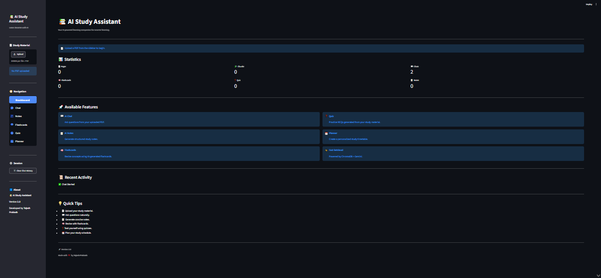
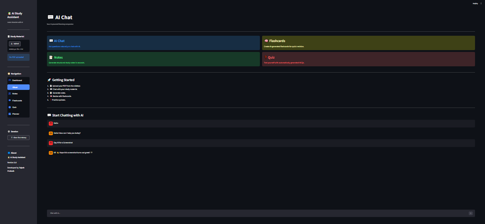
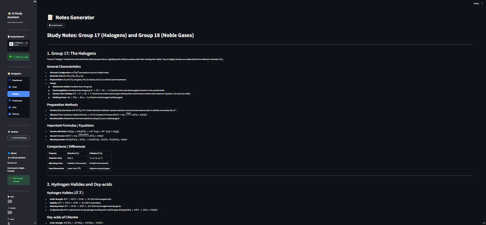
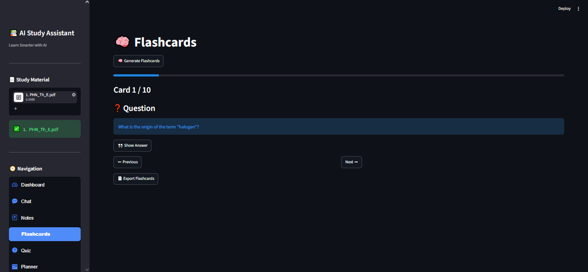
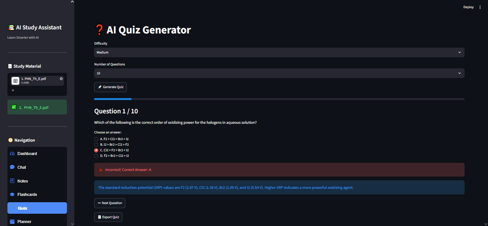
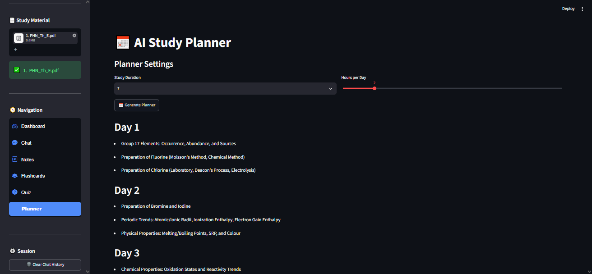

# 📚 AI Study Assistant

An AI-powered study companion that helps students and learners interact with PDF documents intelligently. The application can generate detailed study notes, flashcards, quizzes, and personalized study planners using **Gemini AI** and **RAG (Retrieval-Augmented Generation)**.

---

## ✨ Features

* 💬 **General AI Chat** — Ask questions and chat with Gemini AI.
* 📄 **PDF Chat (RAG)** — Ask questions directly from uploaded PDFs.
* 📝 **Detailed Notes Generator** — Create comprehensive study notes from any document.
* 🧠 **Flashcards Generator** — Generate AI-powered flashcards for quick revision.
* ❓ **Quiz Generator** — Create MCQ quizzes with answers and explanations.
* 📅 **Study Planner** — Generate personalized study schedules.
* 📄 **PDF Viewer** — View uploaded PDFs inside the application.
* 📥 **Export to PDF** — Download generated notes, flashcards, quizzes, and planners.
* ⚡ **Caching & Performance Optimization** — Faster regeneration of AI outputs.

---

## 🖼️ Screenshots

| Dashboard                                      | AI Chat                              |
| ---------------------------------------------- | ------------------------------------ |
|  |  |

| Notes                                  | Flashcards                                       |
| -------------------------------------- | ------------------------------------------------ |
|  |  |

| Quiz                                 | Planner                                    |
| ------------------------------------ | ------------------------------------------ |
|  |  |

---

## 🏗️ Project Architecture

```text
AI-Study-Assistant/
│
├── app.py                     # Main Streamlit application
├── requirements.txt           # Project dependencies
├── README.md                  # Project documentation
│
├── src/
│   ├── services/              # Business logic and AI services
│   ├── ui/                    # Streamlit UI components
│   ├── utils/                 # Helper utilities
│   ├── embeddings.py          # Sentence transformer embeddings
│   ├── retriever.py           # RAG retrieval logic
│   ├── vector_store.py        # ChromaDB vector database
│   ├── chatbot.py             # Gemini AI integration
│   ├── config.py              # Configuration settings
│   └── prompt.py              # AI prompts
│
├── data/                      # Cached AI outputs and generated files
├── database/                  # ChromaDB persistent storage
└── assets/                    # Screenshots and static assets
```

---

## 🛠️ Tech Stack

* **Frontend:** Streamlit
* **AI Model:** Google Gemini AI
* **Embeddings:** Sentence Transformers (all-MiniLM-L6-v2)
* **Vector Database:** ChromaDB
* **PDF Processing:** PyMuPDF
* **PDF Export:** ReportLab
* **Language:** Python

---

## 🚀 Installation

### 1. Clone the repository

```bash
git clone https://github.com/TejashPrakash/AI-Study-Assistant.git
cd AI-Study-Assistant
```

### 2. Create a virtual environment

```bash
conda create -n ai-study python=3.12
conda activate ai-study
```

### 3. Install dependencies

```bash
pip install -r requirements.txt
```

### 4. Add your Gemini API key

Create a `.env` file in the project root and add:

```env
GEMINI_API_KEY=your_api_key_here
```

### 5. Run the application

```bash
streamlit run app.py
```

---

## 📖 How to Use

1. Open the application in your browser.
2. Upload a PDF document from the sidebar.
3. Choose a feature: Chat, Notes, Flashcards, Quiz, or Planner.
4. Interact with the AI to generate study materials.
5. Download the generated content as PDF if needed.

---

## ⚡ Performance Optimizations

* **AI Output Caching:** Notes, flashcards, quizzes, and planners are cached for instant regeneration.
* **Parallel Processing:** Large PDFs are summarized in parallel for faster notes generation.
* **Optimized Gemini Models:** Fast models are used for lightweight tasks, while higher-quality models are used for final outputs.
* **Persistent Vector Storage:** ChromaDB stores embeddings for efficient RAG retrieval.

---

## 🎯 Future Improvements

* [ ] Add page citations in PDF chat responses.
* [ ] Implement streaming AI responses.
* [ ] Add dark/light theme toggle.
* [ ] Support multiple PDF uploads.
* [ ] Add user authentication and cloud storage.
* [ ] Deploy as a full-stack SaaS application.

---

## 👨‍💻 Developer

**Tejash Prakash**

* GitHub: [TejashPrakash](https://github.com/TejashPrakash)
* Project: **AI Study Assistant**

---

## 📜 License

This project is licensed under the **MIT License** — feel free to use and modify it for educational purposes.
